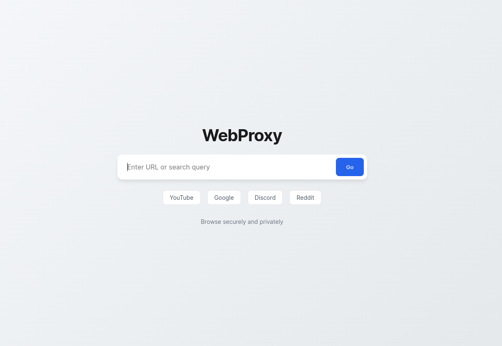

# Exp Web Proxy

A simple web proxy built with Node.js and Express and Ultraviolet.

## Setup

1. Install dependencies

```bash
pnpm install
```

2. Run the development server

```bash
pnpm dev
```

3. Open the browser and navigate to `http://localhost:3000`

## Screenshot


